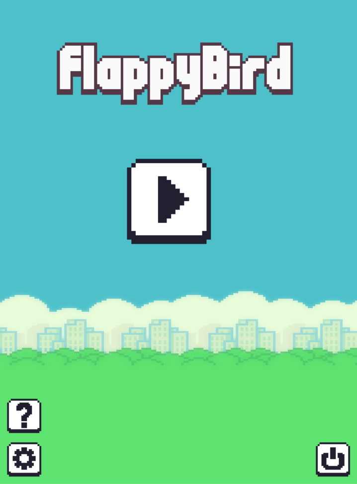

# Flappy Bird Game

This is an old project of mine where I used pygame to create this simple
flappy bird game. I did not really refactor anything or cleaned the code so there might be some deprecated and bad code in here you should not include anymore.

<div class="img-container" style="margin: 20px; display: flex; align-items: center; gap: 10px;">


</div>

# Requirements

The only dependecy is the module pygame so to run the application basically copy this command into your terminal:

```
pip install pygame
```

<b>Note:</b> this will only work asuming you have at least python v3 installed on your local machine.<br>

# COPYRIGHT

<b>DISCLAIMER:</b> None of the artwork or sounds used in the game were made by me I do not own them.
